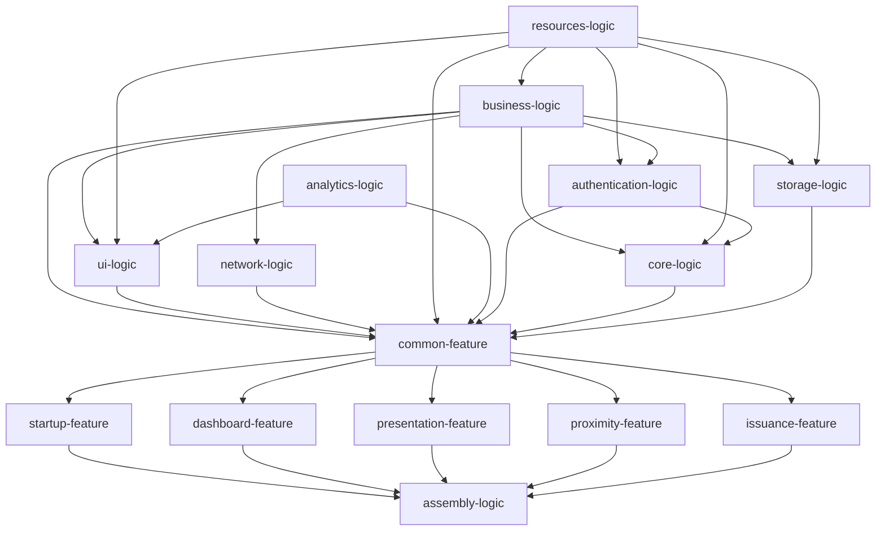

# EUDI Android Wallet reference application

:heavy_exclamation_mark: **Important!** Before you proceed, please read
the [EUDI Wallet Reference Implementation project description](https://github.com/eu-digital-identity-wallet/.github/blob/main/profile/reference-implementation.md)

----

## Table of contents

* [Overview](#overview)
* [Disclaimer](#disclaimer)
* [Important things to know](#important-things-to-know)
* [How to contribute](#how-to-contribute)
* [Demo videos](#demo-videos)
* [How to use the application](#how-to-use-the-application)
* [How to build - Quick start guide](#how-to-build---quick-start-guide)
* [Application configuration](#application-configuration)
* [License](#license)

## Overview

The EUDI Wallet Reference Implementation is built based on the [Architecture Reference Framework](https://github.com/eu-digital-identity-wallet/eudi-doc-architecture-and-reference-framework/blob/main/docs/architecture-and-reference-framework-main.md) and aims to showcase a robust and interoperable platform for digital identification, authentication, and electronic signatures based on common standards across the European Union.
The EUDI Wallet Reference Implementation is based on a modular architecture composed of business-agnostic, reusable components that will evolve in incremental steps and can be re-used across multiple projects.

The EUDI Wallet Reference Implementation is the application that allows users to:

1. To obtain, store, and present PID and mDL.
2. Verify presentations.
3. Share data on proximity scenarios.
4. Support remote QES and more use cases with the modules included.

The EUDIW project provides, through this repository, an Android app. Please refer to the repositories listed in the following sections for more detailed information on how to get started, contribute, and engage with the EUDI Wallet Reference Implementation.
 
# 💡 Specifications Employed

The app consumes the SDK called EUDIW Wallet core [Wallet core](https://github.com/eu-digital-identity-wallet/eudi-lib-android-wallet-core) and a list of available libraries to facilitate remote presentation, proximity, and issuing test/demo functionality following the specification of the [ARF](https://github.com/eu-digital-identity-wallet/eudi-doc-architecture-and-reference-framework), including:
 
- OpenID4VP - draft 24 (remote presentation), presentation exchange v2.0, DCQL
 
- ISO18013-5 (proximity presentation),
 
- OpenID4VCI draft 15 (issuing)
 
- Issuer functionality, to support development and testing, one can access an OID4VCI test/demo service for issuing at: 

  - [EUDI Issuer](https://issuer.eudiw.dev/)

  - [OpenID4VCI PID and mDL Issuer (python)](https://github.com/eu-digital-identity-wallet/eudi-srv-web-issuing-eudiw-py)
 
  - [OpenID4VCI PID and mDL Issuer (kotlin)](https://github.com/eu-digital-identity-wallet/eudi-srv-pid-issuer)
 
Relying Party functionality:
 
To support development and testing, one can access a test/demo service for remote presentation at:

  - [EUDI Verifier](https://verifier.eudiw.dev) 

  - [Web verifier source](https://github.com/eu-digital-identity-wallet/eudi-web-verifier)

  - [Verifier restful backend service source](https://github.com/eu-digital-identity-wallet/eudi-srv-web-verifier-endpoint-23220-4-kt)
 
To support proximity, an Android Proximity Verifier is available as an app that can request PID and mDL with reader authentication available [here](https://install.appcenter.ms/orgs/eu-digital-identity-wallet/apps/mdoc-verifier-testing/distribution_groups/eudi%20verifier%20(testing)%20public)

The issuer, verifier service, and verifier app authentication are based on the EUDIW development [IACA](https://github.com/niscy-eudiw/eudi-app-android-wallet-ui/tree/main/resources-logic/src/main/res/raw)

## Important things to know

The main purpose of the reference implementation is to showcase the ecosystem and act as a technical example of how to integrate and use all of the available components.

If you're planning to use this application in production, we recommend reviewing the following steps:
- Configure the application properly by following the guide [here](wiki/configuration.md)
- Ensure the Pin storage configuration matches your security requirements or provide your own by following this guide [Pin Storage Configuration](wiki/configuration.md#pin-storage-configuration)
- Ensure the application meets the OWASP MASVS industry standard. Please refer to the following links for further information on the controls you must implement to ensure maximum compliance:
    - [OWASP MASVS](https://mas.owasp.org/MASVS/)
    - [Play Integrity API](https://developer.android.com/google/play/integrity)

## How to contribute

We welcome contributions to this project. To ensure that the process is smooth for everyone
involved, follow the guidelines found in [CONTRIBUTING.md](CONTRIBUTING.md).

## Demo videos

Issuance

[Issuance](https://github.com/eu-digital-identity-wallet/eudi-app-android-wallet-ui/assets/129499766/60732c14-653a-46d5-a87a-8973f8823d0f)

Presentation

[Presentation](https://github.com/eu-digital-identity-wallet/eudi-app-android-wallet-ui/assets/129499766/21050222-2c07-4bcd-983b-4f6d4cf20248)

Proximity

[Proximity](https://github.com/eu-digital-identity-wallet/eudi-app-android-wallet-ui/assets/129499766/c92f1818-e64c-463d-98c5-4f9f87c61760)

## How to use the application

### Minimum device requirements

- API level 31.

### Prerequisites

You can download the application (apk file) through GitHub releases [here](https://github.com/eu-digital-identity-wallet/eudi-app-android-wallet-ui/releases)

You will also need to download the Android Verifier app. More information can be found [here](wiki/verifier_proximity.md)

### App launch

1. Launch the application
2. You will be presented with a welcome screen where you will be asked to create a PIN for future logins.

### Issuance flow (Scoped - Wallet initiated)

1. Navigate to the "Dashboard" screen, go to the "Documents" tab, and tap on the "+" icon (top-right of the screen). Select "From list". If it's your first time opening the app, you will be redirected here automatically after entering or setting up your PIN.
2. Select "PID".
3. In the web view that appears, choose "Country Selection", then "FormEU", and tap "Submit".
4. Fill in the form. Any data will suffice, but selecting a birth date older than 18 years is recommended, as it is required for certain app functionalities (e.g., RQES).
5. After submission, a success screen will appear. Tap "Close".
6. You will be redirected to the "Dashboard" screen. If this was your first document added to the Wallet, you will land on the "Home" tab; otherwise, you will be on the "Documents" tab. The flow is now complete.

### Issuance flow (Credential Offer - Issuer initiated)

1. Go to the "Dashboard" screen, navigate to the "Documents" tab, and tap the "+" icon (top-right of the screen). Select "Scan QR".
2. Scan the QR code from the issuer's website [EUDI Issuer](https://issuer.eudiw.dev/credential_offer_choice)
3. Review the documents included in the credential offer and tap "Add".
4. In the web view that appears, select "Country Selection", then "FormEU", and tap "Submit".
5. Fill in the form. Any data will suffice, but selecting a birth date over 18 is recommended, as it is required for certain app functionalities (e.g., RQES).
6. After submission, a success screen will appear. Tap "Close".
7. You will be redirected back to the "Documents" tab within the "Dashboard" screen. The flow is now complete.

To delete a document, navigate to the 'Documents' tab within the 'Dashboard' screen, tap on the document you wish to remove, and then tap the 'Delete Document' button in the 'Document Details' screen.

### Presentation (Online authentication/Same device) flow.

1. Go to the browser application on your device and enter "https://verifier.eudiw.dev"
2. Expand the Person Identification Data (PID) card and select:
    1. "Attributes by" → "Specific attributes".
    2. "Format" → Choose the format of your choice.
3. Tap "Next", then select "Select Attributes".
4. Choose the fields you want to request from the Wallet (e.g., "Family Name" and "Given Name").
5. Review your presentation request, tap "Next", and then select "Open with your Wallet".
6. When prompted to open the wallet app, tap "Open".
7. You will be redirected to the app’s "Request" screen, where you can select or deselect which attributes to share with the Verifier. You must select at least one attribute to proceed.
8. Tap "Share".
9. Enter the PIN you set up during the initial steps.
10. Upon successful submission, tap "Close".
11. A browser will open, confirming that the Verifier has accepted your request.
12. Return to the app. The flow is now complete.

### Proximity flow

1. Log in to the EUDI Wallet app.
2. You will be on the "Home" tab of the "Dashboard" screen.
3. Tap the "Authenticate" button on the first informative card. A modal with two options will appear.
4. Select "In person".
5. You will be prompted to enable Bluetooth (if it is not already enabled) and grant the necessary permissions for the app to use it (if you have not already done so).
6. The Verifier scans the presented QR code.
7. The app's "Request" screen will load. Here, you can select or deselect which attributes to share with the Verifier. You must select at least one attribute to proceed.
8. Tap "Share".
9. Enter the PIN you set up during the initial steps.
10. Upon successful authentication, tap "Close".
11. The Verifier will receive the data you chose to share.
12. You will return to the "Home" tab of the "Dashboard" screen. The flow is now complete.

## How to build - Quick start guide

[This document](wiki/how_to_build.md) describes how you can build the application and deploy the issuing and verification services locally.

## Application configuration

You can find instructions on how to configure the application [here](wiki/configuration.md)

## Disclaimer

The released software is an initial development release version: 
-  The initial development release is an early endeavor reflecting the efforts of a short time-boxed period, and by no means can be considered as the final product.  
-  The initial development release may be changed substantially over time and might introduce new features but also may change or remove existing ones, potentially breaking compatibility with your existing code.
-  The initial development release is limited in functional scope.
-  The initial development release may contain errors or design flaws and other problems that could cause system or other failures and data loss.
-  The initial development release has reduced security, privacy, availability, and reliability standards relative to future releases. This could make the software slower, less reliable, or more vulnerable to attacks than mature software.
-  The initial development release is not yet comprehensively documented. 
-  Users of the software must perform sufficient engineering and additional testing to properly evaluate their application and determine whether any of the open-sourced components are suitable for use in that application.
-  We strongly recommend not putting this version of the software into production use.
-  Only the latest version of the software will be supported

## Package structure

*assembly-logic*: App dependencies.

*build-logic*: Application gradle plugins.

*resources-logic*: All app resources reside here (images, etc.)

*analytics-logic*: Access to analytics providers. Capabilities for test monitoring analytics (i.e., crashes) can be added here (no functionality right now)

*business-logic*: App business logic.

*core-logic*: Wallet core logic.

*storage-logic*: Persistent storage cache.

*authentication-logic*: Pin/Biometry Storage and System Biometrics Logic.

*ui-logic*: Common UI components.

*common-feature*: Code that is common to all features.

*dashboard-feature*: The application's main dashboard.

*startup-feature*: The initial screen of the app.

*presentation-feature*: Online authentication feature.

*issuance-feature*: Document issuance feature.

*proximity-feature*: Proximity scenarios feature.

## License

### License details

Copyright (c) 2023 European Commission

Licensed under the EUPL, Version 1.2 or - as soon they will be approved by the European
Commission - subsequent versions of the EUPL (the "Licence"); You may not use this work
except in compliance with the Licence.

You may obtain a copy of the Licence at:
https://joinup.ec.europa.eu/software/page/eupl

Unless required by applicable law or agreed to in writing, software distributed under 
the Licence is distributed on an "AS IS" basis, WITHOUT WARRANTIES OR CONDITIONS OF 
ANY KIND, either express or implied. See the Licence for the specific language 
governing permissions and limitations under the Licence.
