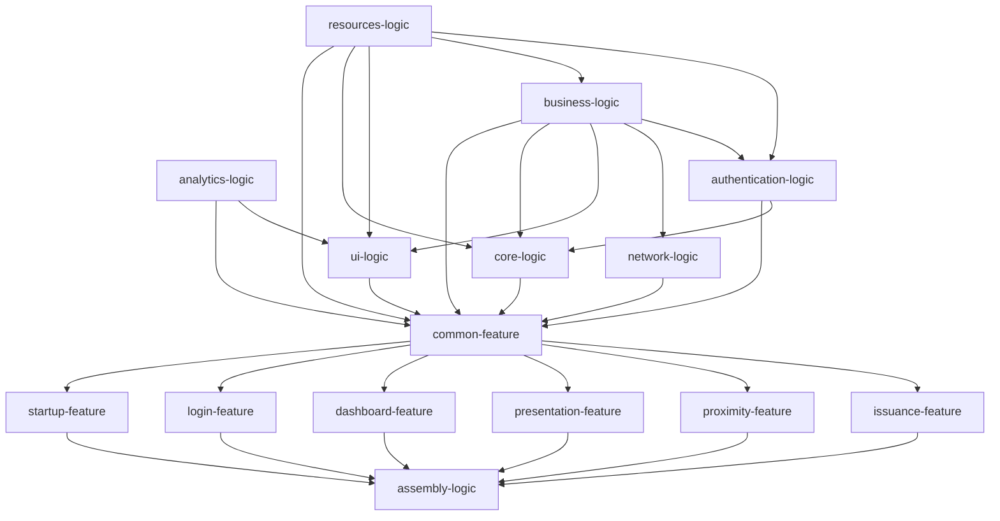

# EUDI Android Wallet reference application

:heavy_exclamation_mark: **Important!** Before you proceed, please read
the [EUDI Wallet Reference Implementation project description](https://github.com/eu-digital-identity-wallet/.github/blob/main/profile/reference-implementation.md)

----

## Table of contents

* [Overview](#overview)
* [Disclaimer](#disclaimer)
* [Important things to know](#important-things-to-know)
* [How to contribute](#how-to-contribute)
* [Demo videos](#demo-videos)
* [How to use the application](#how-to-use-the-application)
* [Application configuration](#application-configuration)
* [License](#license)

## Overview

The EUDI Wallet Reference Implementation is built based on the Architecture Reference Framework and aims to showcase a robust and interoperable platform for digital identification, authentication, and electronic signatures based on common standards across the European Union.
The EUDI Wallet Reference Implementation is based on a modular architecture composed of business-agnostic, reusable components that will evolve in incremental steps and can be re-used across multiple projects.

The EUDI Wallet Reference Implementation is the application that allows users to:

1. To obtain, store, and, present PID and mDL.
2. Verify presentations.
3. Share data on proximity scenarios.
4. Support remote QES and more use cases with the modules included.

The EUDIW project provides through this repository an Android app. Please refer to the repositories listed in the following sections for more detailed information on how to get started, contribute, and engage with the EUDI Wallet Reference Implementation.
 
# 💡 Specifications Employed

The app consumes the SDK called EUDIW Wallet core [Wallet core](https://github.com/eu-digital-identity-wallet/eudi-lib-android-wallet-core) and a list of available libraries to facilitate remote presentation, proximity, and issuing test/demo functionality following specification of the [ARF](https://github.com/eu-digital-identity-wallet/eudi-doc-architecture-and-reference-framework) including:
 
- OpenID4VP - draft 19 (remote presentation), presentation exchange v2.0,
 
- ISO18013-5 (proximity presentation),
 
- OpenID4VCI draft 13 (issuing)
 
- Issuer functionality, to support development and testing, one can access an OID4VCI test/demo service for issuing at: 

  - Draft 12 issuer: ```https://issuer.eudiw.dev/oidc```
  - Draft 13 issuer: ```https://dev.issuer.eudiw.dev```

  - [OpenID4VCI PID and mDL Issuer (python)](https://github.com/eu-digital-identity-wallet/eudi-srv-web-issuing-eudiw-py)
 
  - [OpenID4VCI PID and mDL Issuer (kotlin)](https://github.com/eu-digital-identity-wallet/eudi-srv-pid-issuer)
 
Relying Party functionality:
 
To support development and testing, one can access a test/demo service for remote presentation at:

  - https://verifier.eudiw.dev. 

  - [Web verifier source](https://github.com/eu-digital-identity-wallet/eudi-web-verifier)

  - [Verifier restful backend service source](https://github.com/eu-digital-identity-wallet/eudi-srv-web-verifier-endpoint-23220-4-kt).
 
To support proximity an Android Proximity Verifier is available as an app that can request PID and mDL with reader authentication available [here](https://install.appcenter.ms/orgs/eu-digital-identity-wallet/apps/mdoc-verifier-testing/distribution_groups/eudi%20verifier%20(testing)%20public)

The issuer, verifier service, and verifier app authentication are based on the EUDIW development [IACA](https://github.com/niscy-eudiw/eudi-app-android-wallet-ui/tree/main/resources-logic/src/main/res/raw)

## Disclaimer

The released software is an initial development release version: 
-  The initial development release is an early endeavor reflecting the efforts of a short time-boxed period, and by no means can be considered as the final product.  
-  The initial development release may be changed substantially over time, might introduce new features but also may change or remove existing ones, potentially breaking compatibility with your existing code.
-  The initial development release is limited in functional scope.
-  The initial development release may contain errors or design flaws and other problems that could cause system or other failures and data loss.
-  The initial development release has reduced security, privacy, availability, and reliability standards relative to future releases. This could make the software slower, less reliable, or more vulnerable to attacks than mature software.
-  The initial development release is not yet comprehensively documented. 
-  Users of the software must perform sufficient engineering and additional testing to properly evaluate their application and determine whether any of the open-sourced components are suitable for use in that application.
-  We strongly recommend not putting this version of the software into production use.
-  Only the latest version of the software will be supported

## Important things to know

The main purpose of the reference wallet implementation is to showcase the ecosystem and act as a technical example of how to integrate and use all of the available components.

If you're planning to use it as a production application, we recommend reviewing the following steps:
- Configure the application properly by following the guide [here](wiki/configuration.md)
- Ensure the PIN storage configuration matches your security requirements or provide your own by following this guide [Pin Storage Configuration](wiki/configuration.md#pin-storage-configuration)
- Ensure the application meets the OWASP MASVS industry standard. Please refer to the following links for further information on the controls you must implement to ensure maximum compliance:
    - [OWASP MASVS](https://mas.owasp.org/MASVS/)
    - [Play Integrity API](https://developer.android.com/google/play/integrity)

## How to contribute

We welcome contributions to this project. To ensure that the process is smooth for everyone
involved, follow the guidelines found in [CONTRIBUTING.md](CONTRIBUTING.md).

## Demo videos

Issuance

[Issuance](https://github.com/eu-digital-identity-wallet/eudi-app-android-wallet-ui/assets/129499766/60732c14-653a-46d5-a87a-8973f8823d0f)

Presentation

[Presentation](https://github.com/eu-digital-identity-wallet/eudi-app-android-wallet-ui/assets/129499766/21050222-2c07-4bcd-983b-4f6d4cf20248)

Proximity

[Proximity](https://github.com/eu-digital-identity-wallet/eudi-app-android-wallet-ui/assets/129499766/c92f1818-e64c-463d-98c5-4f9f87c61760)

## How to use the application

Minimum device requirements

- API level 26.

Prerequisites

You can download the application [here](https://install.appcenter.ms/orgs/eu-digital-identity-wallet/apps/eudi-reference-android/distribution_groups/eudi%20wallet%20(demo)%20public)

You will also need to download the Android Verifier app [here](https://install.appcenter.ms/orgs/eu-digital-identity-wallet/apps/mdoc-verifier-testing/distribution_groups/eudi%20verifier%20(testing)%20public)

App launch

1. Launch the application
2. You will be presented with a welcome screen where you will be asked to create a PIN for future logins.

Issuance flow (Scoped)

1. Open the "Add document" screen or if it's the first time you open the app, you will be redirected there after you enter or set up your PIN.
2. Pick "National ID".
3. From the web view that appears select the "FormEU" option and tap submit.
4. Fill in the form. Any data will do.
5. You will be shown a success screen. Tap next.
6. Your "National ID" is displayed. Tap "Continue".
7. You are now on the "Dashboard" screen.

Issuance flow (Credential Offer)

1. Open the "Add document" screen or if it's the first time you open the app, you will be redirected there after you enter or set up your PIN.
2. Tap "SCAN QR".
3. Scan The QR Code from the issuer's website (e.g. https://dev.issuer.eudiw.dev/credential_offer_choice).
4. Review the documents contained in the credential offer and tap "Issue".
5. You will be shown a success screen. Tap "Continue".
6. You are now on the "Dashboard" screen.

While on the "Dashboard" screen you can tap "Add doc" and issue a new document, e.g. "Driving License".

If you want to re-issue a document you must delete it first by tapping on the document in the "Dashboard" screen and tapping the delete icon in the "Document details" view.

Presentation (Online authentication/Same device) flow.

1. Go to the browser application on your device and enter "https://verifier.eudiw.dev"
2. Tap the first option (selectable) and pick the fields you want to share (e.g. "Family Name" and "Given Name")
3. Tap "Next" and then "Authorize".
4. When asked to open the wallet app tap "Open".
5. You will be returned to the app to the "Request" screen. Tap "Share".
6. Enter the PIN you added in the initial steps.
7. On success tap "Continue".
8. A browser will open showing that the Verifier has accepted your request.
9. Return to the app. You are back to the "Dashboard" screen and the flow is complete.

Proximity flow

1. The user logs in successfully to the EUDI Wallet app and views the dashboard.
2. The user clicks the 'SHOW QR/TAP' button to display the QR code.
3. The Relying Party scans the presented QR code.
4. EUDI Wallet User can view the requested data set from the relying party.

    1. The distinction between mandatory and optional data elements is depicted.
    2. The requestor (i.e. relying party) of the data is depicted.
    3. EUDI Wallet User may select additional optional attributes to be shared.
5. EUDI Wallet User selects the option to share the attributes.
6. EUDI Wallet authenticates to share data (quick PIN).
7. User authorization is accepted - a corresponding message is displayed to the  EUDI Wallet User.

## Application configuration

You can find instructions on how to configure the application [here](wiki/configuration.md)

## Package structure

*assembly-logic*: App dependencies.

*build-logic*: Application gradle plugins.

*resources-logic*: All app resources reside here (images, etc.)

*analytics-logic*: Access to analytics providers. Capabilities for test monitoring analytics (i.e. crashes) can be added here (no functionality right now)

*business-logic*: App business logic.

*core-logic*: Wallet core logic.

*authentication-logic*: Pin/Biometry Storage and System Biometrics Logic.

*ui-logic*: Common UI components.

*common-feature*: Code that is common to all features.

*login-feature*: Login feature.

*dashboard-feature*: The application main screen.

*startup-feature*: The initial screen of the app.

*presentation-feature*: Online authentication feature.

*issuance-feature*: Document issuance feature.

*proximity-feature*: Proximity scenarios feature.





## License

### License details

Copyright (c) 2023 European Commission

Licensed under the EUPL, Version 1.2 or - as soon they will be approved by the European
Commission - subsequent versions of the EUPL (the "Licence"); You may not use this work
except in compliance with the Licence.

You may obtain a copy of the Licence at:
https://joinup.ec.europa.eu/software/page/eupl

Unless required by applicable law or agreed to in writing, software distributed under 
the Licence is distributed on an "AS IS" basis, WITHOUT WARRANTIES OR CONDITIONS OF 
ANY KIND, either express or implied. See the Licence for the specific language 
governing permissions and limitations under the Licence.
