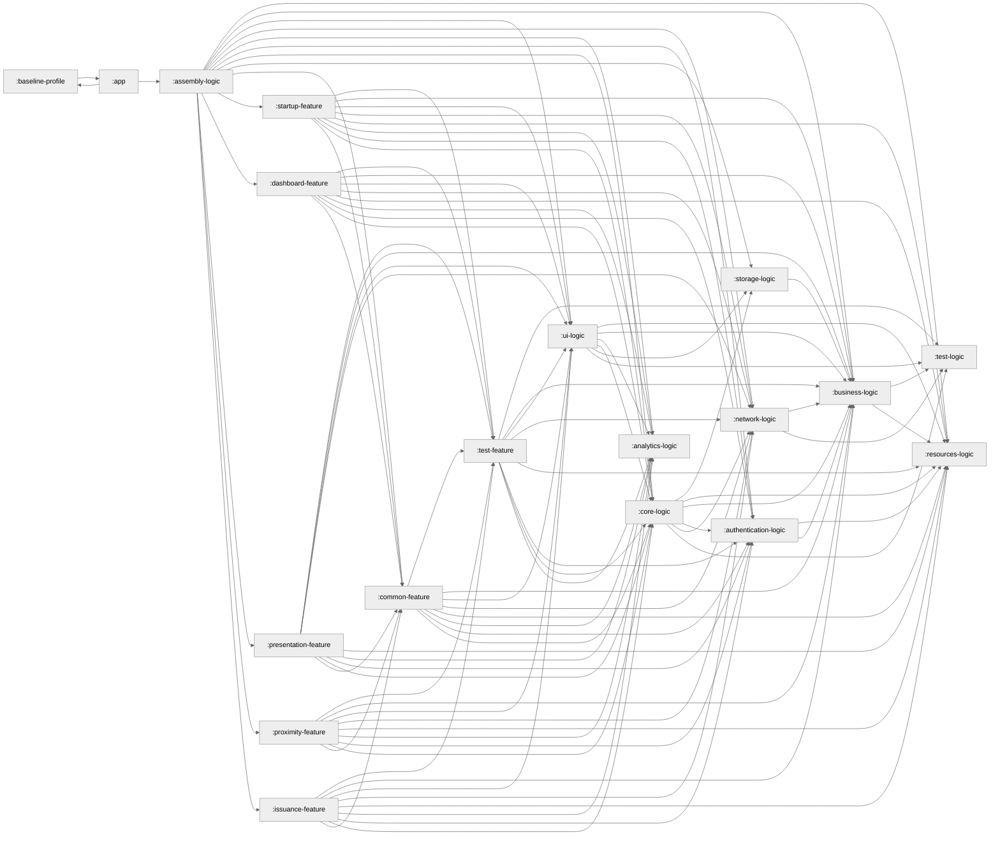

# Module Graph

```mermaid
%%{
  init: {
    'theme': 'neutral'
  }
}%%

graph LR
  :baseline-profile --> :app
  :test-feature --> :test-logic
  :test-feature --> :business-logic
  :test-feature --> :ui-logic
  :test-feature --> :network-logic
  :test-feature --> :resources-logic
  :test-feature --> :authentication-logic
  :test-feature --> :core-logic
  :test-feature --> :analytics-logic
  :business-logic --> :test-logic
  :business-logic --> :resources-logic
  :assembly-logic --> :resources-logic
  :assembly-logic --> :business-logic
  :assembly-logic --> :ui-logic
  :assembly-logic --> :network-logic
  :assembly-logic --> :analytics-logic
  :assembly-logic --> :authentication-logic
  :assembly-logic --> :core-logic
  :assembly-logic --> :storage-logic
  :assembly-logic --> :common-feature
  :assembly-logic --> :startup-feature
  :assembly-logic --> :dashboard-feature
  :assembly-logic --> :presentation-feature
  :assembly-logic --> :proximity-feature
  :assembly-logic --> :issuance-feature
  :ui-logic --> :resources-logic
  :ui-logic --> :business-logic
  :ui-logic --> :analytics-logic
  :ui-logic --> :core-logic
  :ui-logic --> :storage-logic
  :ui-logic --> :test-logic
  :authentication-logic --> :resources-logic
  :authentication-logic --> :business-logic
  :app --> :baseline-profile
  :app --> :assembly-logic
  :common-feature --> :test-feature
  :common-feature --> :business-logic
  :common-feature --> :ui-logic
  :common-feature --> :network-logic
  :common-feature --> :resources-logic
  :common-feature --> :analytics-logic
  :common-feature --> :authentication-logic
  :common-feature --> :core-logic
  :presentation-feature --> :test-feature
  :presentation-feature --> :business-logic
  :presentation-feature --> :ui-logic
  :presentation-feature --> :network-logic
  :presentation-feature --> :resources-logic
  :presentation-feature --> :analytics-logic
  :presentation-feature --> :authentication-logic
  :presentation-feature --> :core-logic
  :presentation-feature --> :common-feature
  :dashboard-feature --> :test-feature
  :dashboard-feature --> :business-logic
  :dashboard-feature --> :ui-logic
  :dashboard-feature --> :network-logic
  :dashboard-feature --> :resources-logic
  :dashboard-feature --> :analytics-logic
  :dashboard-feature --> :authentication-logic
  :dashboard-feature --> :core-logic
  :dashboard-feature --> :common-feature
  :storage-logic --> :business-logic
  :issuance-feature --> :test-feature
  :issuance-feature --> :business-logic
  :issuance-feature --> :ui-logic
  :issuance-feature --> :network-logic
  :issuance-feature --> :resources-logic
  :issuance-feature --> :analytics-logic
  :issuance-feature --> :authentication-logic
  :issuance-feature --> :core-logic
  :issuance-feature --> :common-feature
  :core-logic --> :storage-logic
  :core-logic --> :resources-logic
  :core-logic --> :business-logic
  :core-logic --> :authentication-logic
  :core-logic --> :network-logic
  :core-logic --> :test-logic
  :proximity-feature --> :test-feature
  :proximity-feature --> :business-logic
  :proximity-feature --> :ui-logic
  :proximity-feature --> :network-logic
  :proximity-feature --> :resources-logic
  :proximity-feature --> :analytics-logic
  :proximity-feature --> :authentication-logic
  :proximity-feature --> :core-logic
  :proximity-feature --> :common-feature
  :startup-feature --> :test-feature
  :startup-feature --> :business-logic
  :startup-feature --> :ui-logic
  :startup-feature --> :network-logic
  :startup-feature --> :resources-logic
  :startup-feature --> :analytics-logic
  :startup-feature --> :authentication-logic
  :startup-feature --> :core-logic
  :startup-feature --> :common-feature
  :network-logic --> :business-logic
  :network-logic --> :test-logic
```